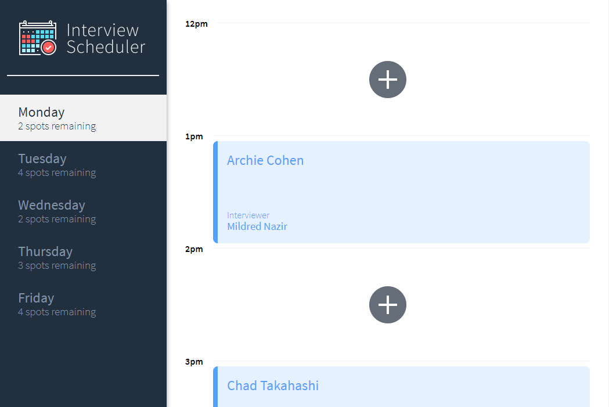
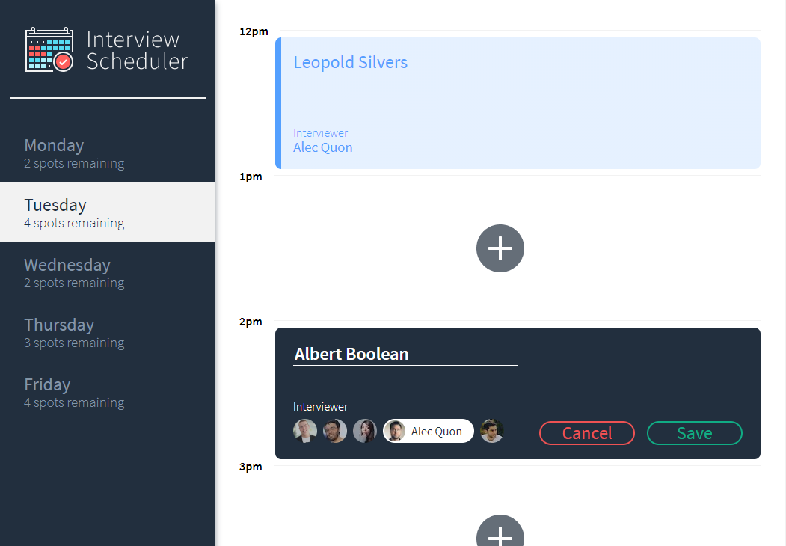

# Interview Scheduler

Scheduler is a single-page application for managing and tracking student interviews:

- Powered by React, Sass and PostgreSQL.
- Components were built in isolation using Storybook.
- Implemented using a TDD (Test Driven Development) methodology: Jest used for unit and integration tests, Cypress used for end-to-end testing.

## Screenshots





## Setup

Install dependencies with `npm install`.

## Running Webpack Development Server

```sh
npm start
```

## Running Jest Test Framework

```sh
npm test
```

## Running Storybook Visual Testbed

```sh
npm run storybook
```
